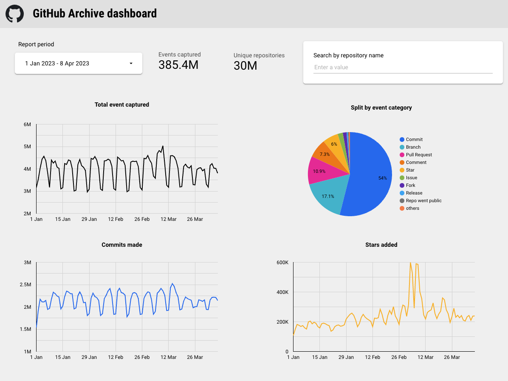
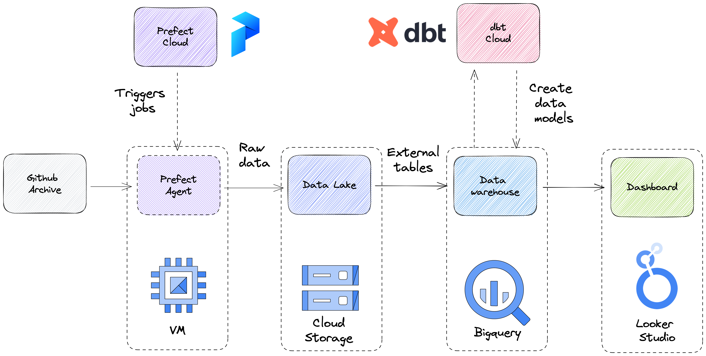
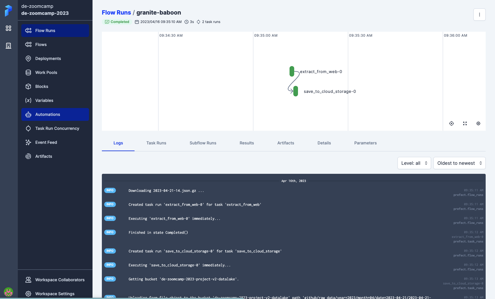
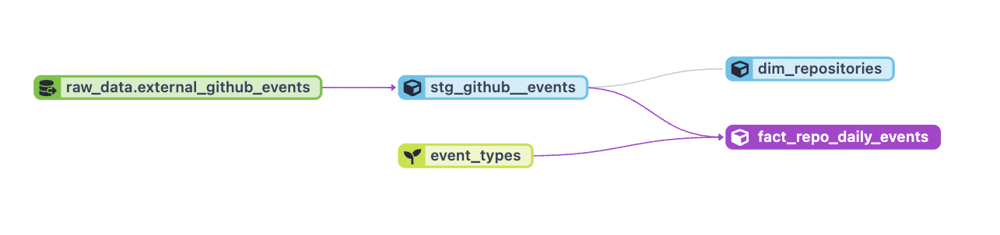

# DE Zooomcamp Project

## Project description

The project is an end-to-end data engineering pipeline that takes GitHub archive data, loads it to cloud storage, uploads it to a data warehouse, transforms it with dbt, and visualizes it using Looker Studio.

GitHub archive data is a public dataset that contains information about GitHub events, such as commits, pull requests, issues, and forks. The data is inteesting for a sevaral reasons. First of all, as an engineer, I was curious about Github activity because I use this service on a daily basis. Secondly, the volume of the data is a real challenge, because for only first 3 months of 2023 it takes about 192GB of compressed data (which is about 1.5TB uncompressed).

To upload the data from the archive to **Google Cloud Storage** I used **Prefect**. Particularly, I used Prefect Cloud (free for one project) as a web UI and scheduler with additional **VM** as worker agent.

Next, I used an external table in **BigQuery** to upload the data from GCS to data warehouse. Then I used **dbt** (data build tool) to transform the data and create analytical models. dbt is a tool that enables you to write SQL queries and manage dependencies between tables. I used dbt to aggregate the GitHub events by date, repository, and event type.

Finally, I used **Looker Studio** to create the dashboard based on the dbt models. Looker Studio is a web-based tool that allows you to explore and visualize data using a drag-and-drop interface. I used Looker Studio to analyze the trends and patterns of GitHub activity over time. It is possible to search for a particular repository and a specified timeframe.

## Project details

The project heavily relies on the cloud. I sed the following services:

- [Google Cloud](https://cloud.google.com/):
    - Virtual machine ([Compute Engine](https://cloud.google.com/compute/)) for running a Prefect Agent
    - [Container registry](https://cloud.google.com/container-registry) to store custom Prefect images
    - [Cloud Storage](https://cloud.google.com/storage) as data lake
    - [BigQuery](https://cloud.google.com/bigquery) as data warehouse
- [Prefect Cloud](https://www.prefect.io/cloud/) to manage scheduled pipelines
- [dbt Cloud](https://www.getdbt.com/) to manage data transformations
- [Looker Studio](https://cloud.google.com/looker-studio) to visualize the data from BigQuery

Components of Google Cloud are created either using Terraform or gcloud CLI.

You will need to create a free accounts on Prefect Cloud and dbt Cloud.

Looker Studio is free and comes with a Google account.

### Data pipeline overview

### Data ingestion

The data is ingested in a **batch manner**. The pipeline is made out of two components:

- Prefect Cloud is used to trigger the pipeline, checking logs of past runs, storing credentials to Google Cloud
- Prefect Agent is extracting and saving the data into Cloud Storage. It is running as a Virtual machine (VM) in GCP

The source data is updated every hour, so the script is also triggered every hour to upload the new batch.

To simplify VM management I made a custom container with Prefect dependencies and create a VM using this container. This makes it easy to manage (spin-up or shutdown the VM with one command) and easy to add new dependencies (e.g. new Python packages) as needed.

### Data Warehouse

**BigQuery** is used as a data warehouse. To upload the data from Cloud Storage to BigQuery I used a [external tables](https://cloud.google.com/bigquery/docs/external-tables). They allow you to read the data directly from the storage without prior uploading that data directly to data warehouse.

However, external tables are slow and have non-optimal performance. Even partitioned external tables are not fast enough for a production usage. That is why on the next stage I create a materialized table that supports both **partitioning** and **clustering**.

Partitioning is made using `event_date` column and allows you to process less data when data filters are applied. Clustering is made using `event_type` column and make it faster to search for a specific event type when querying the data.

### Data transformation

Data transformation is done using **dbt**. Here I'm using dbt Cloud version as it is free for one developer and one project.

Basically, dbt manages the warehouse completely:
- *external tables* are made in dbt using `dbt_external_tables` package
- using *seeds* I'm uploading a custom mapping of event types to event categories and their descriptions
- next, it manages *staging tables* – here I materialize the external table and use tricks like partitioning and clustering to optimize the performance and costs
- finally, data marts are made in an incremental manner with partitioning for better performance

dbt Cloud is responsible for triggering hourly jobs. Also, there are two manual jobs for full refreshing the data and re-creating an external tables (these jobs are dangerous, that's why they are separated from the main hourly job).

On top of that, I made a documentation and tests for my models using dbt.

### Dashboard

The dashboard is made in Looker Studio. (See the screenshot at the top of this page)

It allows you:
- see the number of captured events, commints and stars added over time
- see the split per event category
- select a timeframe
- search for a specific repoository using it's name

The dashboard is connected to the BigQuery production schema.

# Reproducing the project

To reproduce this project for yourself got to the [instructions page](./docs/readme.md).
